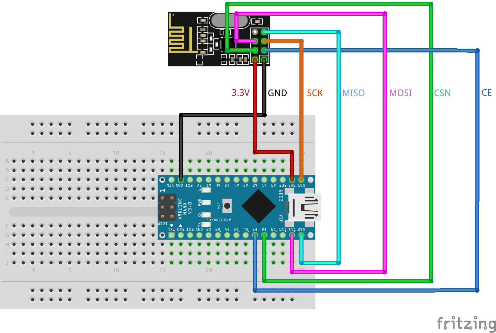

# Cifrados en Arduino

Este repositorio contiene el código que se usará durante los talleres SUMA UC. Se realizará un envío de paquetes cifrados a través del módulo de radiofrecuencia NRF24L01+, haciendo uso de una placa de Arduino Nano.

## Materiales

1. [NRF24L01+](https://www.amazon.com/-/es/Transmisión-E34-2G4D27D-Transceptor-inalámbrico-inteligente/dp/B09MVV8XBX?th=1)
2. [Arduino Nano](https://arduino.cl/arduino-nano/)

## Diseño de Conexiones con Arduino y Módulo de Radiofrecuencia

## Cómo usar el código

Dentro de cada carpeta, que tienen el nombre de cada cifrado, se encuentra su código correspondiente. La nomenclatura es la siguiente:

- `encriptar_*.ino` es para encriptar un mensaje localmente.
- `desencriptar_*.ino` es para desencriptar un mensaje localmente.

Además, en la carpeta `tranceptor` se encuentra:

- `enviar.ino` es para enviar un mensaje a través del NRF24L01+.
- `recibir.ino` es para recibir un mensaje a través del NRF24L01+ y desencriptarlo.
